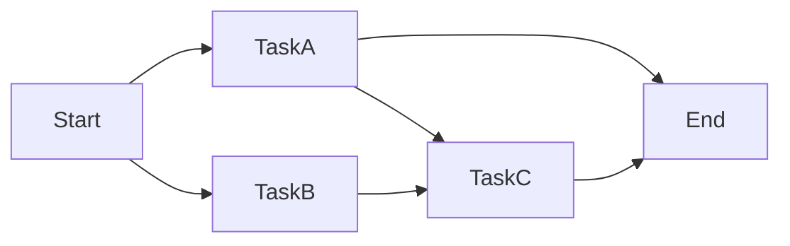

## 0x00 : 前言

上一篇[任务调度系列(1) | Celery篇](https://polobymulberry.github.io/2025/11/12/%E4%BB%BB%E5%8A%A1%E8%B0%83%E5%BA%A6%E7%B3%BB%E5%88%97(1)%20%7C%20Celery%E7%AF%87/)只是简单介绍了单一任务的高并发调度。随着需求的变化，任务类型逐渐丰富，任务之间也出现了相互依赖的情况，经常会需要通过编排不同的任务形成完整的工作流。
<!--more-->

## 0x01 : 举个例子
工作流其实很常见，比如数据处理过程中，有各种数据清洗的策略需要编排，再比如一个线上的图片检测功能，就涉及到上传服务，合规检查服务，图像检测服务三个任务的编排。不过为了方便介绍，我们简化一下，只考虑下面这种情况：

<div style="text-align: center;">



</div>

现在有TaskA，TaskB，TaskC三个任务，如上图所示，通过编排组合这三个任务，产生了三种工作流。下面总结下这些Task的特点：
1. TaskA：一对多，也就是说TaskA既可以单独作为完整的工作流，也可以和TaskC编排形成工作流。
2. TaskB：一对一，只能和TaskC编排形成工作流。
3. TaskC：多对一，也就是说TaskA和TaskB共用TaskC形成工作流。
> 对于TaskC来说，如果TaskC只部署了2个Worker实例（假设一个Worker只有一个并发），而这时候同时进来2个TaskA -> TaskC和2个TaskB -> TaskC的工作流请求，那么势必会导致有两个工作流阻塞在了TaskC这里。所以说多任务编排需要有详细的监控查看整个系统的瓶颈在哪里。

话说回来，如果用Celery框架去部署每个Task，将每个Task当作Worker。这种方案对于TaskA -> End的工作流是没问题的，但是对于TaskA -> TaskC -> End和TaskB -> TaskC -> End就得上Celery提供的Canvas机制进行任务编排[Canvas: Designing Work-flows](https://docs.celeryq.dev/en/stable/userguide/canvas.html)，伪代码如下。

**TaskA Worker (task_a.py)**

```python
from celery import Celery

app = Celery('task_a', broker='redis://localhost:6379/0')

@app.task
def task_a(input_data):
    # 处理逻辑
    result = f"TaskA processed: {input_data}"
    return result
```

**TaskB Worker (task_b.py)**

```python
from celery import Celery

app = Celery('task_b', broker='redis://localhost:6379/0')

@app.task
def task_b(input_data):
    # 处理逻辑
    result = f"TaskB processed: {input_data}"
    return result
```

**TaskC Worker (task_c.py)**

```python
from celery import Celery

app = Celery('task_c', broker='redis://localhost:6379/0')

@app.task
def task_c(input_data):
    # 处理逻辑
    result = f"TaskC processed: {input_data}"
    return result
```

**Master 节点编排代码 (orchestrator.py)**

```python
from celery import chain
from task_a import task_a
from task_b import task_b
from task_c import task_c

def run_task_flow(task_type, input_data):
    if task_type == "A":
        # Start -> TaskA -> End
        return task_a.delay(input_data)
    elif task_type == "A_C":
        # Start -> TaskA -> TaskC -> End
        workflow = chain(task_a.s(input_data), task_c.s())
        return workflow.apply_async()
    elif task_type == "B_C":
        # Start -> TaskB -> TaskC -> End
        workflow = chain(task_b.s(input_data), task_c.s())
        return workflow.apply_async()
```

## 0x02 : Celery在任务编排上的不足

看起来Celery已经能很好的解决任务编排的问题了，但是当工作流越来越复杂之后，我们就会发现使用Celery去组织任务编排已经力不从心了，比如缺乏好用的前端监控界面(flower的功能过于简单)去观察工作流执行状态。再比如对于这样的需求：根据前一个任务的返回结果动态编排接下来的任务，由于Canvas不直接支持条件分支，所以需要采用一些额外手段让Celery支持条件分支，但是这样又会带来更多的维护成本。这个其实是由Celery内在基因决定的，因为Celery本质是分布式的任务队列，并不是专门为工作流编排设计的框架。

在我们的预期中，如果可以像下面这样定义工作流，实现成本和维护成本就会低很多。

```python
@flow
def my_workflow(input_data):
    result = task_a(input_data)
    # 根据前一个任务的结果动态编排后续任务
    if result % 2 == 1:
        return task_b(result)
    else:
        return task_c(result)
```

## 0x03 : 引入专门的任务编排框架
随着工作流越来越复杂，开始尝试引入成熟的任务编排框架。常见的任务编排框架有很多，当然因为目前我常用的语言是Python，所以比较知名的有Apache Airflow，Prefect。经过比较后选择了Prefect，其实到没有什么特别的原因，单纯觉得Airflow太复杂了，暂时用不上。后面会专门开一篇介绍Prefect。